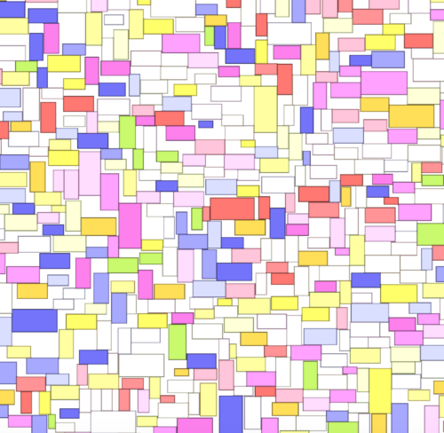

# d3-bboxCollide

`npm install bboxCollide-force`



A bounding box constraint for [forceSimulation](https://github.com/d3/d3-force).

[Here's a data-driven example with 500 nodes.](http://bl.ocks.org/emeeks/96c35bcee81f11a61541d94b0e0b62b4)

You can include it as a `"collide"` constraint in your force simulation for rectangular nodes or bounding boxes around labels. It uses bounding boxes, which are [[],[]] arrays that give the top-left and bottom-right coordinates of a rectilinear space. You can set these bounding boxes manually or base them of the data of the node.

The following would set up a bounding box constraint for a 20x10 rectangle (remember the bounding box is around the center of your node, so the top left corner will be `-10px` for the x-coordinate and `-5px` for the y-coordinate while the bottom right corner of the bounding box will be `10px` for the x-coordinate and `5px` for the y-coordinate).

```
var rectangleCollide = bboxCollide([[-10,-5],[10,5]])
```
Which you would attach to your force like so:

```
var force = d3.forceSimulation(data)
	.force("collide", rectangleCollide)
```